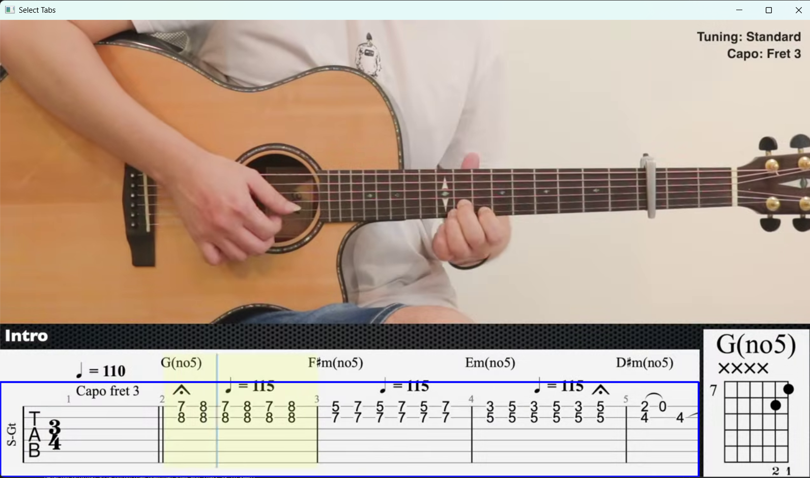
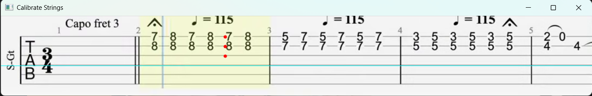
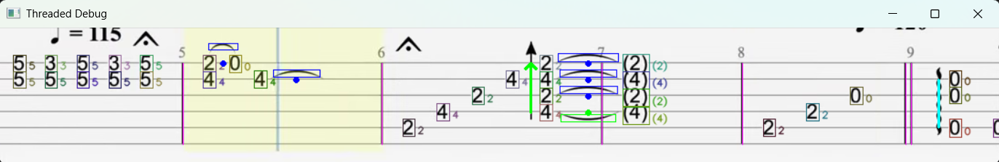
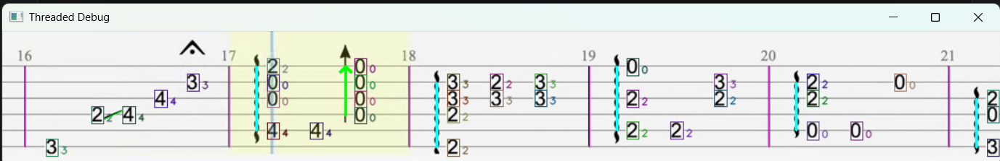
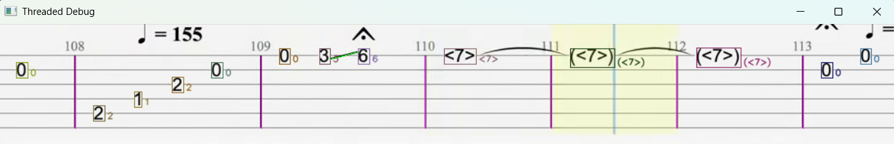
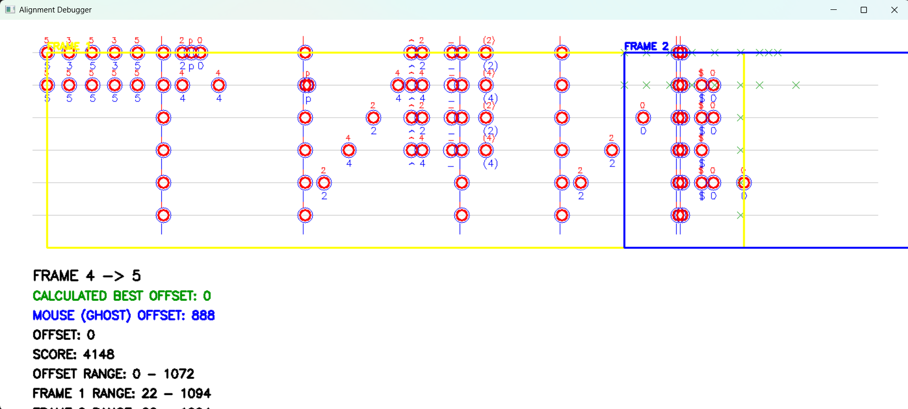
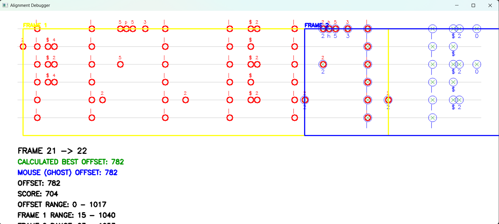
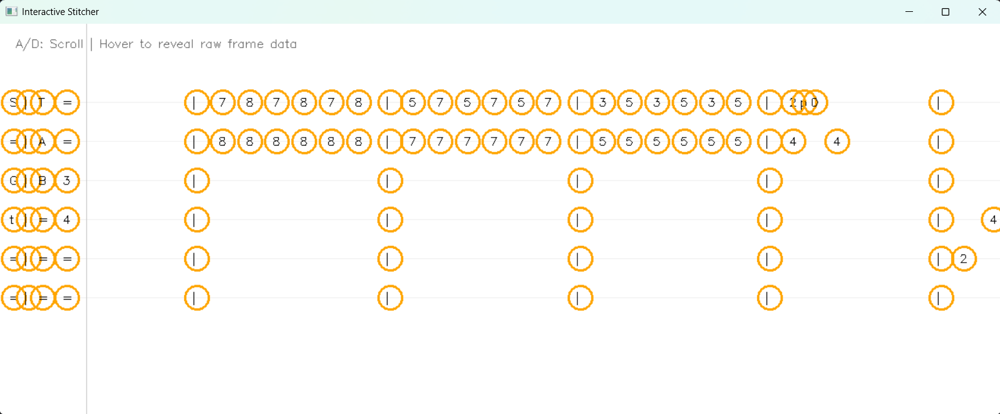

# Video-to-Tab

A pipeline for extracting guitar tablature from video. The project captures frames, detects tab regions, calibrates string positions, reads notes, computes frame offsets, and stitches the final tab into a text export.

## Quick Start

1. Run:
   ```bash
   python main.py
   ```
2. Enter the video URL.
3. Enter the start second.
4. Enter the end second.
5. Enter the gap in seconds between taken frames.

The tool will download the video and begin frame extraction.

## Main Workflow

1. **Select the tab region**
   - Draw a box around the tablature area.
   - Make sure the box includes the full tab region and the area around it.
   - Include hammer-ons and other markings outside the top and bottom string lines.

   

2. **Frame extraction**
   - Frames are saved into `output/frame_dump`.
   - Note: string positions must match in every frame or the pipeline will fail.

3. **String calibration**
   - Select string positions for the tab.
   - This determines the six strings and must stay consistent across all frames.

   

4. **Note reading**
   - The note reader extracts frets, articulations, and special markers from the selected frames.

   
   
   

5. **Offset calculation**
   - The offset calculator aligns adjacent frames to produce a continuous tab.
   - Press `Enter` during the debug animation to skip it and compute immediately.
   - The algorithm is fast; animation is only for visual debugging.

   
   

6. **Stitching and export**
   - The final stitching step merges aligned frames into a full tab.
   - Export produces the stitched tab output.

   

## Manual Step-by-Step Usage

If you want to run the stages manually, use these scripts:

- `video_utils.py` — extract frames from video.
- `note_reading.py` — read notes from extracted frames.
- `calculate_offsets.py` — compute offsets between frames.
- `stiching.py` — stitch frames into a continuous tab.
- `tab_export.py` — export the final stitched tab.

When running manually, make sure:
- `output/frame_dump` contains the extracted frames.
- string positions are aligned in every frame.

## Output and Data Storage

All intermediate and final data is saved to the `output` folder.

Important files and folders:
- `output/frame_dump` — extracted frames.
- `output/detected_templates.json` — template detections.
- `output/string_positions.json` — calibrated string positions.
- `output/offsets.json` — frame offset data.
- `output/stiched_tab.txt` — final stitched tab.
- `output/final_tab.json` — structured tab output.

## Templates

Add or update detection templates in the `templates` folder.
The main template mapping lives in `templates/templates.json`.

## Example Source

This project was tested with the video:

- **Merry Go Round of Life - Howl's Moving Castle | Fingerstyle Guitar | TAB + Chords**
- Channel: **Kenneth Acoustic**

The interactive region and string selection steps are the key manual actions.

## Notes

- Be careful when selecting the region: include enough border so hammer-ons and articulations are inside the box.
- String calibration must be consistent across frames.
- If the strings are misaligned, the note-reading and offset pipeline will produce incorrect results.

## License

Use this code freely for personal or experimental purposes.
